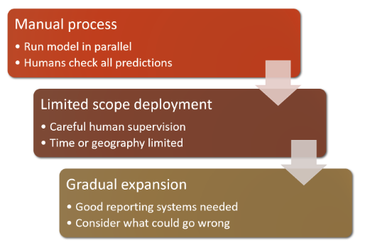

# Untested AI is Dangerous AI

Deep learning models are much harder to both understand and test. Since a neural networks "behaviour emerges from the model's attempt to match the training data, rather than being exactly defined." [FastAI](https://course.fast.ai/)

